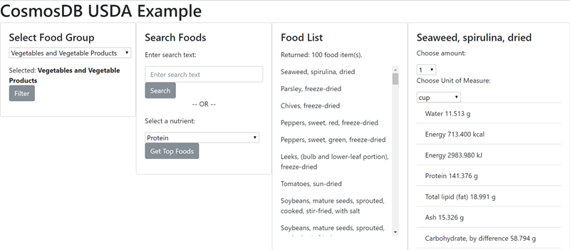

# Explore the Cosmos (DB) Cross-Platform

This repository contains cross-platform .NET Core 2.0 code to populate and access an [Azure Cosmos DB](https://goo.gl/7vXu26) database. It will actually work with any Mongo database. You have options to configure the end point, host, username, password, and database.

> **DISCLAIMER:**
> Use of Cosmos DB will incur charges against your Azure account. Please be aware of these charges and understand any activity against the Azure instance will result in fees. You can alternatively use a local emulator or connect to a Mongo database.

## Configuration

The applications that require configuration all prioritize, in order, environment variables then `appsettings.json`. This allows you to set the variables in the environment, or, if you are hosting the app, use the environment and/or app settings feature on the host to configure secrets. The variables and their explanation follows:

* USDA_PORT: the port to access the database (default for Cosmos DB is 10255)
* USDA_HOST: the host URL
* USDA_DATABASE: the database name
* USDA_USER: the database user
* USDA_PASSWORD: the database password

The connector uses SSL and assumes the credential is `SCRAM-SHA-1`.

## Database setup: `usda-importer`

Use this console tool to configure the collections and import data for the demo. It can take several minutes to run. The data is imported from the SR28 version of the [USDA National Nutrient Database for Standard Reference](https://www.ars.usda.gov/northeast-area/beltsville-md/beltsville-human-nutrition-research-center/nutrient-data-laboratory/docs/usda-national-nutrient-database-for-standard-reference/). The URLs for the data files are configured in `appsettings.json`.

The importer will load the data files, parse them into entities, correlate related entities, drop existing collections, create new collections, and import the data. Three collections are created:

* `foodGroups` is a list of categories for food items
* `nutrientDefinitions` is a list of nutrient data collected for each food item (i.e. Protein, Calories, etc.)
* `foodItems` is the master list of foods

## Projects

The following projects exist and reference each other through relative paths:

* `usda-connector`: common code for connecting to the database
* `usda-console-test`: simple test to ensure database connections work and data exists
* `usda-importer`: code to pull files from the USDA database site, parse them, and insert them into the database
* `usda-models`: common models for the data
* `usda-web-api`: Web API interface to browse the data
* `usda-web-vuejs`: Static webiste to explore the API using HTML, JavaScript, jQuery and Vue.js

## Containers

You can package the application with several containers. The `Dockerfile` at the root of the project will build a .NET Core 2.0 container that is ready to run the web API endpoint. It does require that you pass the right environment variables to connect to the CosmosDB instance.

The `Dockerfile` in the root of `usda-web-vuejs` will package a tiny web server with the HTML and JavaScript necessary to run the explorer app. It is important that you update the correct URL in the `cosmos.js` file.

## Full walkthrough (requires Azure and Docker)

This walkthrough assumes you have a valid Azure account with credits, and either have the Azure CLI installed locally or will use the built-in Azure Cloud Shell. You should also have a Docker host available, either locally or on a virtual machine. These instructions assume a Bash shell. For Windows, they will work on both Ubuntu on Windows as well as git-bash.

Clone this repository:

```bash
git clone https://github.com/JeremyLikness/explore-cosmos-db.git
cd explore-cosmos-db
```

Create a resource group to host your project (choose any name):

```bash
groupname=usda-group
location=westus
az group create --name $groupname --location $location
```

Create a CosmosDB instance. The name must be globally unique across the Azure cloud, so you may have to choose a different name.

```bash
dbname=cosmos-usda
az cosmosdb create --name $dbname -g $groupname \
    --default-consistency-level ConsistentPrefix --kind MongoDB
```

After it is created, open the Azure portal, navigate to the CosmosDB resource and select "Connection String." Copy these values (using the clipboard icon to the right) and export them to your environment:

```bash
export USDA_USER=<Username>
export USDA_DATABASE=$dbname
export USDA_HOST=<Host>
export USDA_PASSWORD=<Password>
```

Navigate to the root of the console import app and build it.

```bash
cd usda-importer
dotnet restore
dotnet build -c Release
```

Navigate to the output directory and run the importer tool. This may take several minutes to complete.

```bash
cd bin/Release/netcoreapp2.0/
dotnet usda-importer.dll
```

You can execute the remaining steps while the app is importing. Open a new shell and set the environment variables with your credentials.

> As an optional step, browse to the `usda-console-test` directory, build the application, and run it. This will confirm the app is able to retrieve data from your CosmosDB instance. Be sure to export your environment variables or set them in `appsettings.json` so it has the right credentials to connect!

Navigate back to the root directory (`explore-cosmos-db`) and build the Docker image for the API (this must be done from the root, and not the project sub-directory, because it has multiple project dependencies):

```bash
docker build -t usda-api .
```

Run the Docker image:

```bash
docker run -d -p 5000:80 -e USDA_USER=$USDA_USER \
    -e USDA_DATABASE=$USDA_DATABASE -e USDA_HOST=$USDA_HOST \
    -e USDA_PASSWORD=$USDA_PASSWORD usda-api
```

Browse to [http://localhost:5000/api/foodGroups](http://localhost:5000/api/foodGroups) and confirm you receive the list of food groups. This means it is successfully accessing the database.

Navigate to the directory of the web app and build the BusyBox container:

```bash
cd usda-web-vuejs
docker build -t usda-web .
```

Run the website container:

```bash
docker run -d -p 80:80 usda-web
```

Browse to [http://localhost:80](http://localhost:80) to use the app.



For example, to find a list of the foods in the "vegetable" category that have the highest protein content, select "Vegetables and vegetable products" in the group dropdown, "Protein" in the nutrient dropdown and click "Get Top Foods." When the Food List returns, click on a food item to see the nutrient breakdown.

Read [Docker Containers at Scale with Azure Web App on Linux](https://blog.jeremylikness.com/docker-containers-at-scale-with-azure-web-app-on-linux-da22c03d4ad7) to learn how to deploy your containers to Azure. Alternatively, you may deploy them individually using [Azure Container Instances](https://goo.gl/EBjBLg) (be sure to update the URL in the `cosmos.js` script file before deploying the app).
